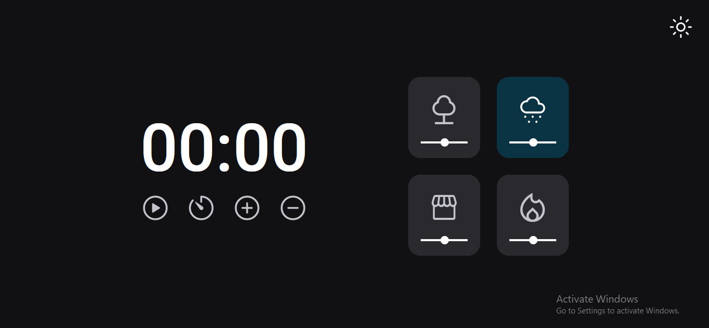

<h1 align = center>FocusTimer 3.0</h1>

This was the second challenge of the third module of level 05.

	<a href="#technologies">Technologies</a>&nbsp;&nbsp;&nbsp;|&nbsp;&nbsp;&nbsp;
	<a href="#project">Project</a>&nbsp;&nbsp;&nbsp;|&nbsp;&nbsp;&nbsp;
	<a href="#demonstration">Demonstration</a>&nbsp;&nbsp;&nbsp;

  

 

## Technologies
This project used these technologies:

- HTML;
- CSS;
- JavaScript;
- Git.

 

## Project
This is a timer to help the user focus on a task. 
This timer is based on the [previous timer project](../focus-timer-enhanced/), but it has extra controls and a few other things. 
In this project, i reused the FocusTimer 2.0 code and made a few adjustments. Added new features and improved the code overall with some refactoring. 
Features:
- A timer which you can set a custom time or add/subtract five minutes from the current time.
- Multiple relaxing background noises (forest, rain, coffee shop and fireplace). Also, each sound has a volume slider.
- Dark/light mode.

 

## Demonstration
https://user-images.githubusercontent.com/87144284/213337322-e208a61a-761d-413c-94e6-a8cf57fc53bd.mp4

---
 

### Thanks for reading!  Diego
